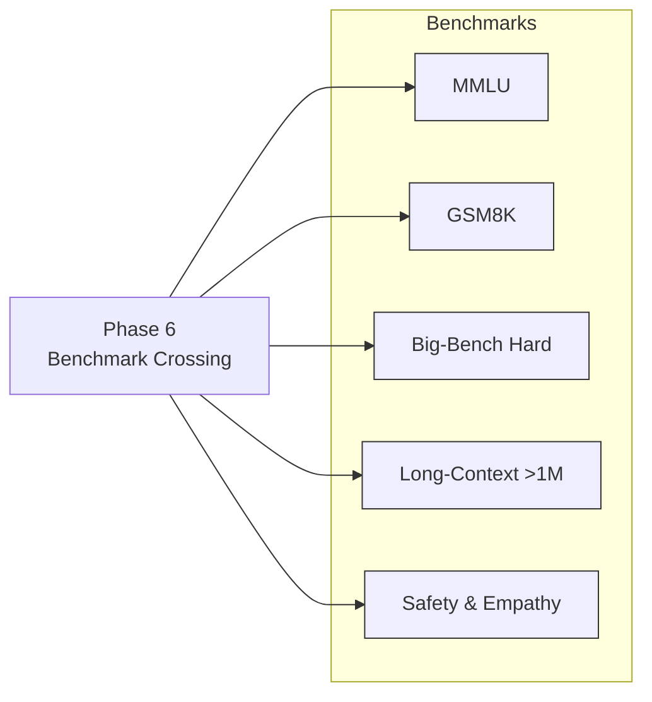

# 🌊 Wave-Graph Grammar-Core LLM

A new paradigm for language models: **law-driven, recursive, efficient**.

## 🚀 Vision
Instead of brute-force scaling (trillions of tokens, $100M+ compute),
this project encodes **immutable grammar laws** as the foundation.

- **Grammar Core** = fixed rules of language (syntax, morphology).
- **Automated Vocabulary Expansion** = plug new words without retraining.
- **Emotion → Behavior Mapping** = human alignment built-in.
- **Feedback Loops** = self-evolution from interaction.
- **Multimodal Alphabets** = text, images, audio, code unified by grammar.

## 🌱 Why?
- 100× efficiency vs. current LLMs.
- Alignment and interpretability are native.
- Enables a **self-evolving AI agent**.

## 📘 Roadmap
See [ROADMAP.md](ROADMAP.md) for detailed milestones and phases.

---

## 🛠️ Stepwise Plan with Impact Approach (Benchmark-Crossing Trajectory)

### Phase 1: Grammar Core Foundation
- Encode English grammar as immutable CFG + morphology rules.
- Impact: Demonstrates that grammar can be engineered once, removing the need for LLMs to “relearn” syntax.

### Phase 2: Automated Vocabulary Expansion
- Crawl lexicons, auto-classify words, insert into grammar.
- Impact: Shows the model can expand domain knowledge instantly without retraining.

### Phase 3: Emotion → Behavior Layer
- Map lexical polarity and bigrams to emotional fields → behavioral predictions.
- Impact: Integrates empathy, sentiment, and alignment from the start.

### Phase 4: Reciprocal Feedback Loops
- Deploy controlled demos, integrate user feedback directly into emotional map.
- Impact: Enables **continuous alignment** without costly retraining.

### Phase 5: Multimodal Alphabets
- Extend grammar rules to visual (edges, shapes), audio (phoneme spectra), and code (formal grammars).
- Impact: Establishes **unified multimodal reasoning** using one lawful framework.

### Phase 6: Benchmark Crossing & Validation
- Evaluate against Google-scale LLM benchmarks: MMLU, BIG-Bench Hard, GSM8K, long-context tasks, empathy/safety datasets.
- Impact: Proves the system matches or surpasses Gemini-class LLMs with <1% of compute and data.

### Phase 7: Self-Evolving Agent
- Multi-agent simulations; emergent norms and behaviors.
- Impact: Moves beyond text completion → toward autonomous socio-emotional agents.

---

## 🎯 Final Benchmark Goal
- Match or exceed **Google Research’s frontier LLMs** (Gemini-class, 2025) across:
  - **Reasoning benchmarks** (MMLU, GSM8K, BIG-Bench Hard).
  - **Long-context** (>1M tokens) with grammar-based coherence.
  - **Safety & empathy** benchmarks (GoEmotions, EmpatheticDialogues).
  - **Efficiency proofs**: 100× less compute & training data.

✅ **Impact:** A paradigm shift from brute-force transformer scaling to **law-driven, recursive evolution**, enabling sustainable, interpretable, and self-evolving AI.

## 🗺️ Visual Roadmap
```mermaid
flowchart TD
  A[Phase 1\nGrammar Core] --> B[Phase 2\nAutomated Vocabulary]
  B --> C[Phase 3\nEmotion → Behavior]
  C --> D[Phase 4\nReciprocal Feedback]
  D --> E[Phase 5\nMultimodal Alphabets]
  E --> F[Phase 6\nBenchmark Crossing]
  F --> G[Phase 7\nSelf-Evolving Agent]

  subgraph Impact
    I1[100× Efficiency]\nI2[Native Alignment]\nI3[Long-Context Coherence]\nI4[Open, Modular Growth]
  end

  A -.lays laws.-> I4
  C -.affective priors.-> I2
  E -.shared grammar.-> I3
  F -.pareto frontier.-> I1
```

## 📊 Benchmark Map

## 📄 License
Apache License 2.0 — see [LICENSE](LICENSE).
